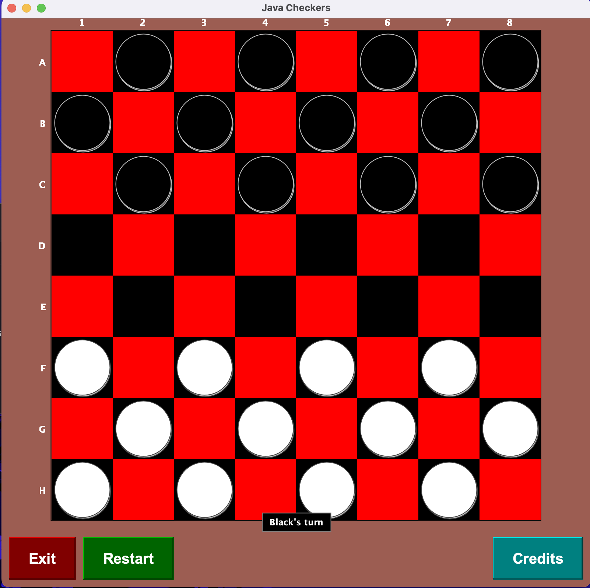

# Checkers Project

Welcome to the Checkers Project. This is a Java-based implementation of the classic game of checkers, featuring a graphical user interface, game logic, and a model representing the game's state.



## Structure

The project is organized into three main folders, each encapsulating a different aspect of the application:

- **logic**: Contains classes related to the game's mechanics and rules.
  - `moveGenerator.java`: Generates valid moves for the pieces.
      The MoveGenerator class in the logic package provides utilities for determining valid moves and skips for checkers on a game board. It offers methods to generate possible move and skip end-points for a given checker based on its current position. For moves, it considers the piece's type (regular or king) and direction of movement allowed (downward for black, upward for white, and both directions for kings). For skips, it ensures that the end position is vacant and that an opponent's piece is being skipped over. It filters out invalid moves or skips, such as those landing on occupied squares or moving in an invalid direction for a non-king piece. The class supports functionality to translate between point and index representations of board positions, aiding in the calculation of potential moves and verification of their validity within the game's rules.
  - `moveLogic.java`: Applies the rules for moving pieces and captures.
      The MoveLogic class in the logic package is designed to validate moves in a game of checkers, ensuring they adhere to the game's rules. It determines if a move is valid by considering the current board state, which player's turn it is, and whether the move is a regular one or a skip (a move that captures an opponent's piece). This involves checking that the destination square is empty, the move is diagonal, and for skips, that an opponent's piece is being jumped over and the landing square is unoccupied. It also ensures moves are in the correct direction based on the piece type—regular pieces move forward, while kings can move both forward and backward. Additionally, the class includes a method to determine if a piece is 'safe,' meaning it cannot be skipped (captured) by an opponent on their next turn. This comprehensive implementation of checkers' rules ensures that all potential moves are legitimate within the context of a given game state.

- **model**: Defines the entities that represent the game's state.
  - `Board.java`: Represents the checkers board, tracking piece positions.
      The Board class in the model package represents the game state for an 8x8 checkerboard. In checkers, pieces move diagonally and are restricted to the 32 dark tiles on the board. This class is designed to be memory-efficient, using only three integers to store the entire board state, with 3 bits allocated for each tile.

      The class defines constants for different piece types, including empty tiles, black checkers, white checkers, black kings, and white kings. It offers methods to get and set the state of tiles, find all tiles occupied by a specific piece type, and reset the board to the initial game state. It can also create a copy of the board state, which is useful for simulations and undo functionality.

      Conversion methods are provided to translate between tile indices and (x, y) coordinates, considering the checkerboard pattern. The class includes functionality to determine if a move is valid based on the checkerboard's specific rules, ensuring that pieces move correctly and kings are accounted for.

    The Board class encapsulates the logic necessary to manage the board's state efficiently and provides the necessary operations to support the gameplay of checkers.
  - `Game.java`: Controls the flow of the game, turns, and game status.
    The Game class encapsulates the state and logic for a game of checkers. It maintains the game board, which player's turn it is, and the index of the last skip, which is important for handling multiple skips in one turn. The class provides methods to reset the game, make moves, and check if a game is over based on the ability of players to make legal moves. It ensures that all moves made during the game are valid and conforms to the rules of checkers.

    This class uses an instance of the Board class to represent the game board and utilizes the MoveGenerator and MoveLogic classes from the logic package to validate moves. The move method is central to the class's functionality, executing a move if it's valid and updating the game state accordingly, including the transition of a checker to a king and the switch of turns between players.

    The game state can be represented as a string for easy storage or transmission, and this representation can be used to reconstruct the game state using the setGameState method. The isGameOver method checks whether any player has any legal moves left, indicating the end of the game. Overall, the Game class is responsible for managing the flow of a checkers game, ensuring the game's rules are followed, and maintaining the integrity of the game state.
  - `HumanPlayer.java`: Represents a human player, handling their interactions.
  The HumanPlayer class in the model package represents a human participant in a game of checkers. Unlike an AI or automated player, the human player interacts with the game through a user interface, typically by clicking on tiles on the checkerboard to make moves. This class extends from a Player base class and overrides methods to denote that this player is human and to handle game updates. The updateGame method is intentionally left empty because the human player's moves are not determined programmatically within the class but rather through the UI where the player inputs their moves. This class is essential for distinguishing between different types of players in the game, especially in a context where the game logic needs to know whether to expect user input or to calculate a move algorithmically.
  - `Move.java`: Defines a move made by a player.
  The Move class represents a checker move with a start and end position, and an associated weight used to evaluate the move's effectiveness. It allows for move creation using either index or Point objects, and offers methods to adjust the move's weight. The class also includes a constant for invalid move weight, indicating moves that are not allowed or strategic.
  - `Player.java`: An abstract class that represents a player in the game.
  The Player class is an abstract representation of a player in a checkers game. It determines whether the player is human, requiring user interaction to update the game, or an AI, which programmatically updates the game state. It provides an abstract updateGame method that subclasses must implement to define how they make moves within the game. The class also includes a toString method for displaying basic player information.

- **ui**: Manages the user interface and interaction.
  - `CheckerBoard.java`: Visual representation of the checkers board in the UI.
  The CheckerBoard class extends JButton and represents the user interface for a checkerboard in a game of checkers. It manages the game state and player interactions, such as selecting and moving checker pieces. The class contains methods to configure the button, handle mouse clicks, paint the checkerboard, and update the game state. It also defines the board's appearance, including the color of tiles and checkers, and displays messages for the current player's turn and game over state. The update method is called to refresh the board's appearance based on the latest game state. The paint method is overridden to draw the checkerboard, checkers, and additional UI elements like labels and turn indicators. The class interacts with Game, Board, and MoveGenerator classes to facilitate the checkers game logic.
  - `CheckersWindow.java`: Main application window, integrating all UI components.
  The CheckersWindow class extends JFrame and serves as the main window for the Java Checkers game. It sets up the game by initializing the main checkerboard (CheckerBoard) and the options panel (OptionPanel). The window is sized to a default width and height of 800 pixels each, and it is centered on the screen. The background color is set to a wood brown, emulating the look of a traditional checkerboard.

    This class provides the functionality to restart the game through the restart method, which resets the game state and updates the board. It also includes a showCredits method that displays the developers' names. The getBoard method allows other parts of the application to access the CheckerBoard component.

    Upon execution, the application starts by displaying the CheckersWindow, ready for a game of checkers. The main method serves as the entry point of the application.
  - `Main.java`: The entry point for the application.
  The Main class is the entry point for a Java Checkers game, which includes the main method to start the application. It initializes the user interface to match the system's look and feel for a more native application appearance. The main method creates an instance of CheckersWindow, setting default close operation and making the window visible, thus launching the checkerboard UI for the game.

    The class also contains a description with the standard rules of checkers, such as the movement of checkers, the process of kinging, mandatory skipping, and the endgame conditions. It specifies that black checkers move first and outlines the diagonal movement rules, emphasizing that the game ends when a player has no checkers left or cannot make a move. This information sets the scene for how the game is expected to be played within the application.
  - `OptionPanel.java`: Allows players to set game options.
    The OptionPanel class is a JPanel used in the Checkers game UI to provide interactive buttons to the user. It's a part of the game's graphical user interface, offering "Exit", "Restart", and "Credits" buttons. The panel has a wood brown background to match the checkerboard theme.

    Each button is styled with a raised bevel border and a shadow effect for depth. The "Exit" button has a deep red color and terminates the application when clicked. The "Restart" button is dark green and resets the game state when clicked. The "Credits" button is teal and displays the game's credits upon clicking.

     The layout of the panel is set to BorderLayout, with buttons spaced evenly for aesthetic appeal. The buttons change to a brighter color when hovered over, providing visual feedback to the user. The OptionPanel adds functionality and enhances the user experience by allowing interaction with the game through these controls.

## Getting Started

### Prerequisites

Make sure you have the Java Development Kit (JDK) installed to compile and run the Java files.

### Compilation

To compile the project, navigate to the `src/` directory in your terminal or command prompt and execute the following commands:

```shell
cd src/
javac ui/*.java model/*.java logic/*.java
java ui.Main
```
This will launch the checkers game window where you can interact with the game through the user interface.
